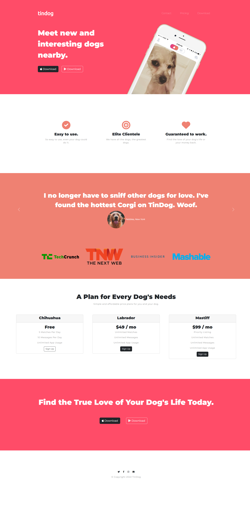
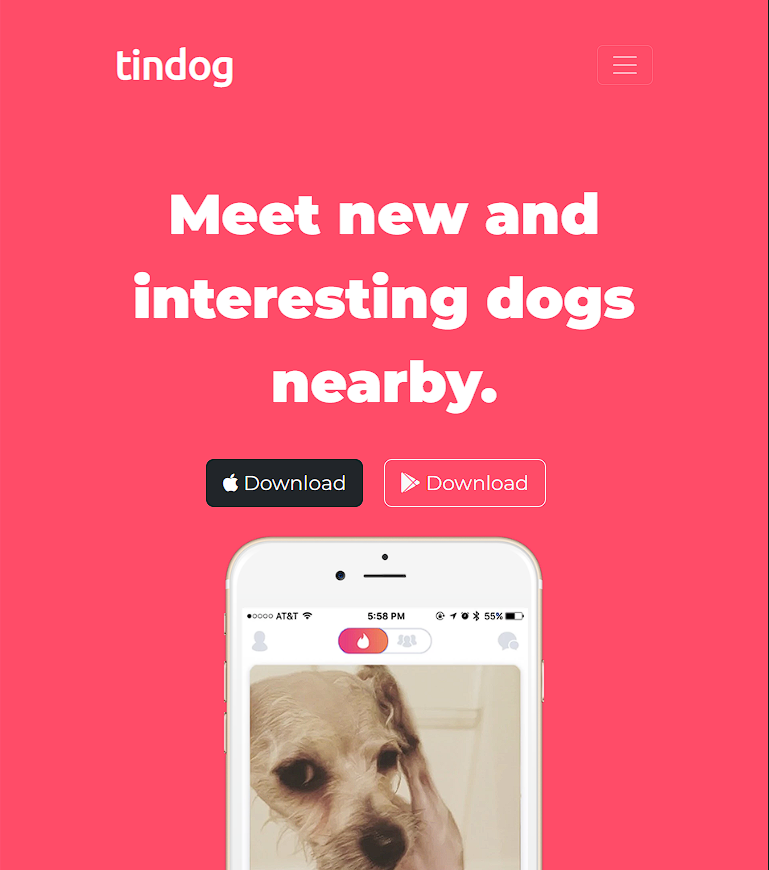
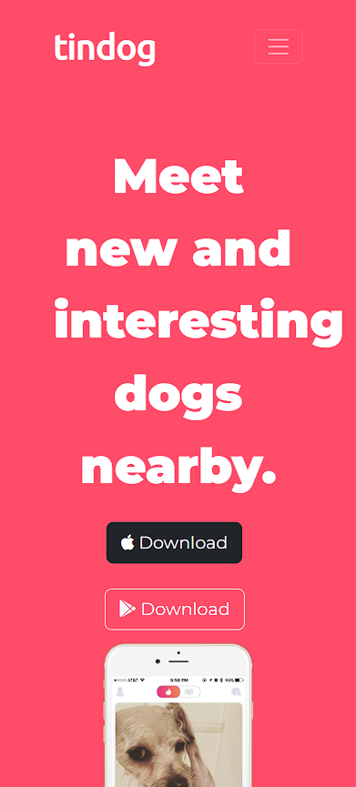

# Tindog

## About

Tindog is a landing page prototype developed during [The Complete 2022 Web Development Bootcamp](https://www.udemy.com/course/the-complete-web-development-bootcamp/) course.

Tindog is a website to find the best match for your dog. Available on Android and iOS, it's easy to use, has a elite clientele and... Look, it is Tinder, but for dogs, okay?

Designed by: [Angela Yu](https://www.udemy.com/user/4b4368a3-b5c8-4529-aa65-2056ec31f37e/).

## Screenshots

### Desktop

### Tablet

### Phone

